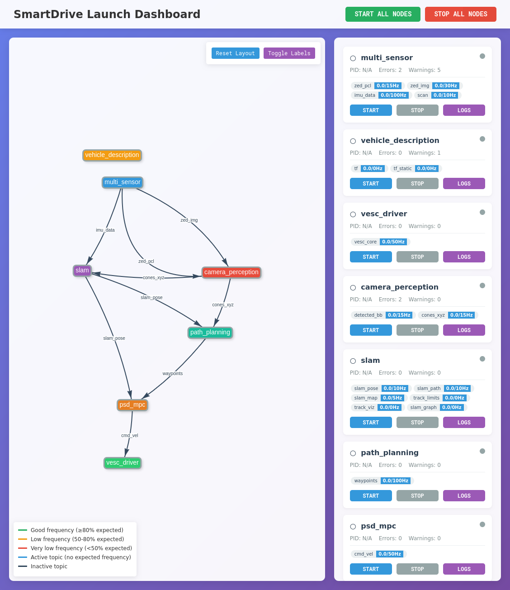

# SmartDrive Launch Dashboard



A comprehensive web-based dashboard for monitoring and managing ROS2 nodes in the SmartDrive autonomous vehicle system. This dashboard provides real-time visualization, process management, and monitoring capabilities for all components of the autonomous vehicle pipeline.

## Features

### Real-time Monitoring
- **Node Status Visualization**: Visual status indicators (green/yellow/red/gray) for each ROS2 node
- **Topic Frequency Monitoring**: Real-time tracking of ROS2 topic publishing frequencies
- **Interactive Pipeline Graph**: Network visualization showing node connections and data flow
- **Live Log Streaming**: Real-time log output from individual nodes with color-coded severity levels

### Process Management
- **Individual Node Control**: Start/stop specific nodes with proper process group management
- **Ordered Launch Sequence**: Automated sequential startup of all nodes in the correct dependency order
- **Graceful Shutdown**: Proper SIGINT/SIGTERM handling for clean node termination
- **Error Recovery**: Automatic retry mechanisms and failure detection

### Web-based Interface
- **Responsive Design**: Modern, mobile-friendly web interface
- **Multi-device Access**: Connect from any device on the network
- **Real-time Updates**: WebSocket-based live updates without page refresh
- **Draggable Layout**: Customizable node positioning with persistent storage

## System Architecture

The SmartDrive system consists of the following nodes launched in order:

### 1. Multi Sensor (`multi_sensor`)
**Command**: `ros2 launch multi_sensor_launcher multi_sensor.launch.py`
**Description**: Manages all sensor inputs including ZED camera, IMU, and LiDAR
**Published Topics**:
- `/zed/zed_node/point_cloud/cloud_registered` (15 Hz) - Point cloud data
- `/zed/zed_node/left/image_rect_color` (30 Hz) - Camera images
- `/imu/data` (100 Hz) - IMU sensor data
- `/scan` (10 Hz) - LiDAR scan data

### 2. Vehicle Description (`vehicle_description`)
**Command**: `ros2 launch psd_vehicle_description view_psd_vehicle.launch.py`
**Description**: Publishes the vehicle's URDF and transforms
**Published Topics**:
- `/tf` - Transform tree
- `/tf_static` - Static transforms

### 3. VESC Driver (`vesc_driver`)
**Command**: `ros2 launch vesc_driver vesc_driver_node.launch.py`
**Description**: Motor controller interface for vehicle actuation
**Published Topics**:
- `/vesc/core` (50 Hz) - Vehicle state information
**Subscribed Topics**:
- `/cmd_vel` - Velocity commands

### 4. Camera Perception (`camera_perception`)
**Command**: Custom perception node with YOLO detection
**Description**: Object detection and perception processing using neural networks
**Published Topics**:
- `/detected_bb` (15 Hz) - Detected bounding boxes
- `/possible_cones_xyz` (15 Hz) - 3D cone positions
**Subscribed Topics**:
- `/zed/zed_node/left/image_rect_color` - Camera input
- `/zed/zed_node/point_cloud/cloud_registered` - Point cloud input

### 5. SLAM (`slam`)
**Command**: `ros2 run psd_slam psd_slam_node`
**Description**: Simultaneous Localization and Mapping
**Published Topics**:
- `/slam/pose` (10 Hz) - Vehicle pose estimation
- `/slam/path` (10 Hz) - Trajectory path
- `/slam/map` (5 Hz) - Generated map
- `/slam/track_limits` - Track boundary information
- `/slam/track_boundaries_viz` - Visualization data
- `/slam/graph` - SLAM graph structure
**Subscribed Topics**:
- `/imu/data` - IMU data for pose estimation
- `/possible_cones_xyz` - Landmark observations

### 6. Path Planning (`path_planning`)
**Command**: `ros2 run psd_path_planning exploration_standalone`
**Description**: Generates trajectory waypoints for autonomous navigation
**Published Topics**:
- `/trajectory_waypoints` (100 Hz) - Planned trajectory
**Subscribed Topics**:
- `/slam/pose` - Current vehicle pose
- `/possible_cones_xyz` - Environmental obstacles

### 7. MPC Controller (`psd_mpc`)
**Command**: `ros2 launch psd_mpc acados_mpc.launch.py`
**Description**: Model Predictive Controller for vehicle motion control
**Published Topics**:
- `/cmd_vel` (50 Hz) - Vehicle control commands
**Subscribed Topics**:
- `/slam/pose` - Current pose for control feedback
- `/trajectory_waypoints` - Target trajectory

## Installation

### Prerequisites
- Ubuntu 20.04+ with ROS2 Foxy/Galactic/Humble
- Python 3.8+
- Network access for web dashboard

### Dependencies
Install required Python packages:
```bash
pip install -r requirements.txt
```

Required packages:
- `flask==3.0.0` - Web framework
- `flask-socketio==5.3.5` - WebSocket support
- `python-socketio==5.10.0` - Socket.IO implementation
- `eventlet==0.33.3` - Async networking library

### ROS2 Setup
Ensure ROS2 is properly installed and sourced:
```bash
source /opt/ros/humble/setup.bash  # Adjust for your ROS2 distribution
export ROS_DOMAIN_ID=42
```

## Usage

### Quick Start
Use the provided shell script for easy startup:
```bash
./launch_vehicle.sh
```

### Advanced Usage
Launch with specific options:
```bash
# Auto-start all nodes on dashboard launch
./launch_vehicle.sh --auto-start

# Use custom port
./launch_vehicle.sh --port 8080

# Combine options
./launch_vehicle.sh --auto-start --port 8080
```

### Manual Launch
For direct Python execution:
```bash
# Basic launch
python launch_dashboard.py

# With options
python launch_dashboard.py --port 5000 --auto-start

# Test topic connectivity
python launch_dashboard.py --test-topics
```

### Command Line Options
- `--port PORT` - Web server port (default: 5000)
- `--auto-start` - Automatically start all nodes on launch
- `--no-browser` - Don't open browser automatically
- `--test-topics` - Test topic availability without starting dashboard

## Web Interface

### Dashboard Access
Once running, access the dashboard at:
- **Local**: `http://localhost:5000`
- **Network**: `http://[YOUR_IP]:5000`

The dashboard automatically displays all available network interfaces for easy access from other devices.

### Interface Components

#### Pipeline Visualization
- Interactive node graph showing system architecture
- Real-time status indicators on node borders
- Topic flow visualization with frequency color coding
- Draggable nodes with persistent positioning
- Hover tooltips with detailed information

#### Node Control Panel
- Individual start/stop buttons for each node
- Real-time status updates (running/stopped/error)
- Topic frequency monitoring with expected vs. actual rates
- Error and warning counters
- Quick access to node logs

#### Log Viewer
- Real-time log streaming with WebSocket updates
- Color-coded log levels (error/warning/info)
- Searchable and scrollable log history
- Individual node log isolation
- Automatic log rotation to prevent memory issues

### Status Indicators

#### Node Status Colors
- **Green**: Node running normally
- **Yellow**: Node running with warnings
- **Red**: Node running with recent errors
- **Gray**: Node stopped

#### Topic Frequency Colors
- **Green**: Frequency ≥80% of expected rate
- **Orange**: Frequency 50-80% of expected rate
- **Red**: Frequency <50% of expected rate
- **Blue**: Topic active but no expected frequency defined
- **Gray**: Topic inactive

## Configuration

### Node Positioning
Node positions in the graph visualization are automatically saved and restored. You can:
- Drag nodes to reposition them
- Right-click a node to reset its position
- Use "Reset Layout" button to restore default grid layout

### Launch Order Customization
Modify the node launch order in `launch_dashboard.py` in the `setup_nodes()` function. The order is critical for proper system initialization.

### Topic Monitoring
Expected topic frequencies are defined in each node's configuration. Adjust these values based on your system's performance requirements.

## Architecture Details

### Process Management
The dashboard uses Python's `subprocess` module with process groups for proper child process management. Key features:

- **Process Groups**: Uses `os.setsid()` to create process groups for proper cleanup
- **Graceful Shutdown**: SIGINT → SIGTERM → SIGKILL escalation
- **Child Process Tracking**: Monitors all spawned processes including launch file children
- **Automatic Restart**: Failed processes can be restarted individually

### Topic Monitoring
Real-time topic frequency monitoring using multiple approaches:

- **ROS2 Topic Hz**: Uses `ros2 topic hz` commands for accurate frequency measurement
- **Persistent Monitoring**: Long-running topic monitors for continuous updates
- **Frequency Caching**: Caches frequency data for responsive UI updates
- **Expected vs. Actual**: Compares measured frequencies against expected values

### Web Framework
Flask-based web server with WebSocket support:

- **Flask-SocketIO**: Real-time communication with web clients
- **Multi-client Support**: Multiple users can connect simultaneously
- **Background Tasks**: Separate threads for monitoring and broadcasting
- **Network Discovery**: Automatic detection of available network interfaces

## Troubleshooting

### Common Issues

#### Dashboard Won't Start
```bash
# Check Python dependencies
pip install -r requirements.txt

# Verify ROS2 environment
source /opt/ros/humble/setup.bash
echo $ROS_DOMAIN_ID
```

#### Nodes Fail to Start
```bash
# Check ROS2 installation
ros2 node list

# Verify workspace setup
source /path/to/your/workspace/install/setup.bash

# Check individual node commands
ros2 launch multi_sensor_launcher multi_sensor.launch.py
```

#### Web Interface Not Accessible
- Check firewall settings for the dashboard port
- Verify network connectivity
- Try accessing via `localhost` first
- Check console for error messages

#### Topic Frequencies Show Zero
```bash
# Test topic availability manually
ros2 topic list
ros2 topic hz /your/topic/name

# Check node publishing status
ros2 node info /your/node/name
```

### Debugging

#### Enable Debug Mode
For detailed logging, modify the Flask app configuration:
```python
socketio.run(app, host='0.0.0.0', port=args.port, debug=True)
```

#### Log Analysis
Check individual node logs through the web interface or command line:
```bash
# View specific node output
ros2 run your_package your_node --ros-args --log-level DEBUG
```

#### Network Issues
Test connectivity:
```bash
# Check port availability
netstat -tlnp | grep :5000

# Test from another machine
curl http://[DASHBOARD_IP]:5000/api/nodes
```

## Development

### Code Structure
```
psd_dashboard/
├── launch_dashboard.py      # Main dashboard server
├── launch_vehicle.sh        # Startup script
├── requirements.txt         # Python dependencies
├── node_positions.json      # Saved node positions
├── templates/
│   └── dashboard.html       # Web interface
└── dashboard/               # Python virtual environment
```

### Adding New Nodes
To add a new node to the dashboard:

1. **Update Node Configuration** in `setup_nodes()`:
```python
NodeConfig(
    name="your_node_name",
    command="ros2 run your_package your_node",
    topics_pub=["/your/published/topic"],
    topics_sub=["/your/subscribed/topic"],
    expected_freq={"/your/published/topic": 10.0},
    color="#yourcolor",
    position=(x, y)
)
```

2. **Update Launch Order** in `startAll()` and `stopAll()` functions
3. **Test the Configuration** with `--test-topics` flag

### Extending Functionality
The dashboard architecture supports easy extension:

- **New Monitoring Features**: Add to the `ProcessManager` class
- **UI Enhancements**: Modify `dashboard.html` template
- **API Endpoints**: Add new Flask routes for additional functionality
- **Real-time Data**: Use SocketIO events for new data streams

## Performance Considerations

### Resource Usage
- **Memory**: ~50MB base + ~10MB per active node
- **CPU**: Minimal impact (<5% on typical systems)
- **Network**: WebSocket updates are lightweight (<1KB/s per client)

### Scalability
- Supports monitoring 10+ nodes simultaneously
- Multiple web clients can connect without performance impact
- Topic frequency monitoring scales with number of active topics

### Optimization Tips
- Increase log rotation limits for long-running sessions
- Adjust update frequencies in `setInterval` calls for slower systems
- Use `--no-browser` flag on headless systems

## License

This project is part of the SmartDrive autonomous vehicle system. Please refer to the main project license for usage terms.

## Contributing

For contributions and issues:
1. Follow ROS2 coding standards
2. Test with multiple node configurations
3. Ensure web interface compatibility across browsers
4. Document any new configuration options

## Support

For technical support and questions about the SmartDrive Launch Dashboard, please refer to the main SmartDrive project documentation or contact the development team.
